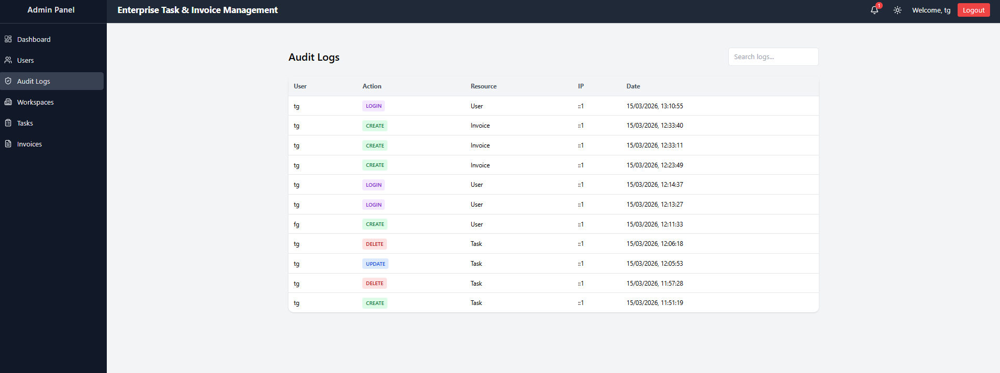
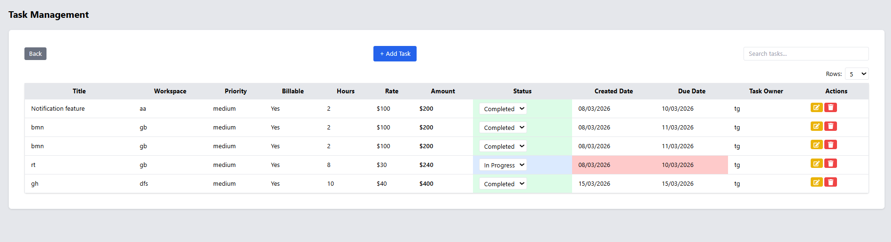
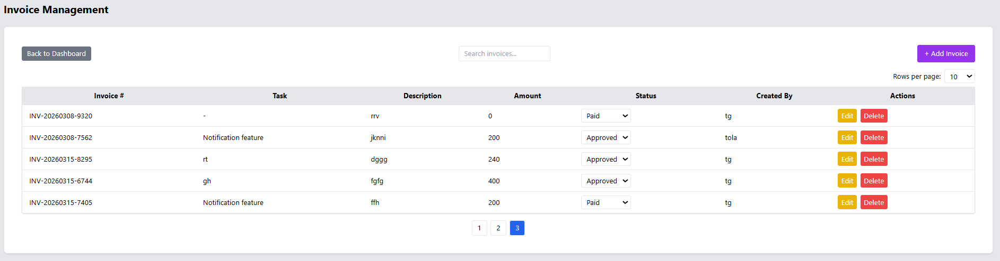

# Team Task Manager (MERN)

A full-stack task and invoice management system built with the MERN stack.

## Features

- User authentication (JWT)
- Role-based access (Admin / Operator / User)
- Task management
- Invoice generation and approval workflow
- Real-time notifications (Socket.io)
- Audit logging system

## Tech Stack

Frontend:
- React
- Vite
- Axios

Backend:
- Node.js
- Express
- MongoDB

Deployment:
- Vercel (Frontend)
- Render (Backend)

## Installation

### Backend
cd backend
npm install
npm run dev

### Frontend
cd frontend
npm install
npm run dev
## Screenshots

